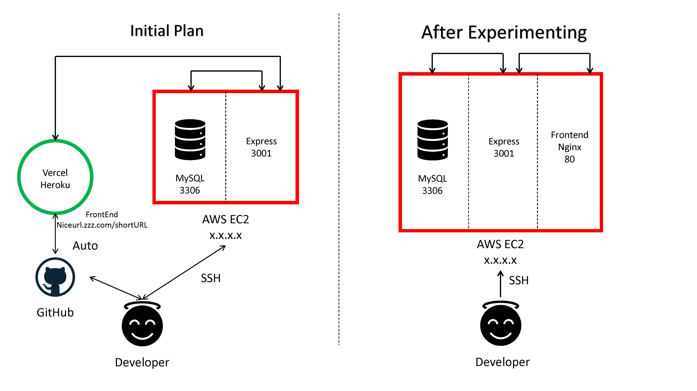

# MicroURL 🔗

## This is ported over to FireBase(FireStore). I did this so as to make the app self sustaining (Free) instead of using a structured DB.

Please refer to Preview.

##### Shorten a URL 
##### GovTech Takehome Assignment 

## For Backend Codes refer [here](https://github.com/tengfone/urlshortener_be)

---
## Table of Contents
* [Prerequisites](#Prerequisites)
* [Description](#Description)
* [System Design](#system-design)
* [Setup](#Setup)
  + [FrontEnd](#frontend)
  + [BackEnd](#backend)
  + [MySQL](#mysql)
* [Preview](#Preview)
* [FrontEnd](#FrontEnd)
* [BackEnd](#backend)
* [Test Cases](#testcase)
* [Summary](#summary)
## Prerequisites
Run either via Cloud or Locally
### Local:
- A Computer
### Cloud:
- [AWS Account](https://aws.amazon.com/account/) || [AWS EC2 Instance](https://aws.amazon.com/ec2/) || AWS Ubuntu 20.x
### Technology Stack Required:
- [NodeJS (Express)](https://expressjs.com/)
- [ReactJS](https://facebook.github.io/react/)
- [MySQL](https://www.digitalocean.com/community/tutorials/how-to-install-mysql-on-ubuntu-20-04)
## Description
1. Create a backend API server (of any preferred tech stack) to be able handle the conversion of a given URL to a shortened version of the URL
2. Create a frontend application (of any preferred tech stack) that allows users to submit a request to convert a URL, and prints the converted URL to the screen
3.  Store the converted URL in a relational database (of your choice)

## System Design
Before starting the assignment, the initial plan was to host the front end on a commericall serverless site like Vercel / Heroku.

However, it poses to be a problem when I met with plenty of security protocol issues such as invalid certification signing as there was a difference in my backend server running in HTTP and the web deployed sites (Heroku/Vercel) using HTTPS. 

The reason why I wanted to use Heroku and Vercel was because they provide a nice looking URL link eg microurl.vercel.app/microurl.heroku.app etc and also it has CI/CD deployment, after a push to the Github everything is done and automated for me.

Therefore I have decided to serve this entire assignment on a single AWS EC2 small Ubuntu 20.x. The SQL server will be listening on port 3306, the front end will be running via NGINX port 80 and the backend API server will be on port 3001. 



## Setup
### Frontend 
Either on local or cloud 
```
git clone https://github.com/tengfone/urlshortener
cd urlshortener
npm install
```
Please ensure that you have a ```.env``` file located at the root directory that consist of the following params:
```
REACT_APP_URL_API=YOURBACKENDAPIHERE
```
Then you can ```npm run start``` to start the frontend server.


### Backend

Either launch on Cloud or Local. As this project is developed on the cloud, please follow the cloud instructions on setting up. I have written a bash script for the backend portion to automate the entire process from installing the SQL server to setting permissions and loading in the SQL scripts.

## Cloud:  

Prerequisite:  
- AWS Instance  

Steps:

Launch an EC2 Instance ```Ubuntu Server 20.04 LTS (HVM), SSD Volume Type - ami-09e67e426f25ce0d7 (64-bit x86)``` (Tested on T2.Small)  

Change Security Group in AWS Security Wizard to open all TCP Port to anywhere (Please change accordingly to your default params - MySQL port and your IP SSH address)

SSH into your AWS server by  
```
ssh -i <SSH_KEY_PATH> ubuntu@<YOUR_EC2_PUBLIC_IP>
```

Clone repo and run bash script (Please edit required passwords in bash script):
```

git clone https://github.com/tengfone/urlshortener_be

cd urlshortener_be

chmod +x start.sh

sudo ./start.sh
```

The whole process will take about 3 minutes. Once completed, visit ```AWS_IP_ADDRESS:3001``` on your web browser and you will see a ```message:welcome``` indicating everything is working.  

## Local:  
Have not tested this locally.

Please ensure that you have a ```.env``` file located at the root directory that consist of the following params:

```
HOST=YOURDBHOSTURL

USER=YOURDBUSER

PASSWORD=YOURDBPASSWORD

DB=YOURDBNAME

PORT=3306
```

Then you can ```node server.js``` to start the backend server.

Please note that you are required to have MySQL server v8 to be installed on the local computer.


### MySQL
Ensure you have one user with permission to write on the database. Create a database with the following table called ```url```. The commands are as follows:

```
CREATE TABLE url (  
ShortURL varchar(255) PRIMARY KEY NOT NULL, 
LongURL varchar(2048) NOT NULL,  
TimeCreated timestamp NOT NULL,  
TimeExpire timestamp NOT NULL
);
```
## Preview

*Might Update Again when CSS is final


## FrontEnd
The front end is written using ReactJS [here](https://github.com/tengfone/urlshortener) and certain libraries which can be found [here](https://github.com/tengfone/urlshortener/blob/main/package.json). 

I have modularize the Web App shown below:
```
.
+-- .env
+-- public
|   +-- favicons
|   +-- ...
+-- src
|   +-- assets
|		+-- fonts
|		+-- url.svg
|   +-- components
|		+-- Header.js
|		+-- Header.css
|	+-- pages
|		+-- Homepage.js
|		+-- ...
|	+-- App.js
|	+-- ...
+-- package.json
+-- ...
```

I have written all of the pages as a functional component. However it is also good to note that I am using Bootstrap to provide minimal styling to the website. 
## BackEnd
The front end is written using NodeJS running Express [here](https://github.com/tengfone/urlshortener_be) 

The Backend has also been modularized so as to easily append new method APIs in the future. However, it is noted that currently I am serving the backend using http and not https, this is because I can only self-sign the certificate and certain browsers rejects self-signed API calls. To solve this problem is a matter of having a signed certificate. However due to time constraints, I will just serve the API via http.

## MySQL
Using a relational database, I have chosen MySQL as I am alittle more familiar with MySQL. I have hosted MySQL on the AWS EC2 Small Server running Ubuntu 20.x. The data structure of MySQL is as follows: 
- Long URL: 2kb (2048char)
- Short URL: 255 Bytes (255char) [PRIMARY KEY] *
- Created Time: 4 Bytes (timestamp)
- Expire: 4 Bytes (timestamp)


If this application is required to scale to high traffic, I would propose the use of ZooKeeper to make it a distributed system. However, seeing the scale of this assignment, I believe that this set up is more than enough

For the Primary Key (ShortURL), if a user does not specify an alias, it will generate a random 8 character ShortURL using B62 encoding. A-Z,a-z,0-9. I have also capped the user input for the ShortURL to 10 characters max. The LongURL has a maximum of 2048 character as that is the maximum characters a URL can have. 

## Testcase

### Backend

Run via ```npm run test```

Libraries for API testing:

- Chai

- Mocha

  

There are a total of 4 test cases.

#### Create

  | Test Case # | Description | Test Scenario | Test Steps | Test Data | Expected Results | Actual Results | Pass / Fail |
|-|:-:|-|-|-|-|-|-|
| 1 | Check if MySQL is online and able to log in | Check if able to establish to connection to MySQL | 1. Retrieve Authentication Data for MySQL 2. Check if the result is an object | HOST=TargetHost USER=TargetUser PASSWORD=TargetPassword DB=url PORT=3306 | An Object | Object Returned | Pass |
| 2 | Sending new data into MySQL with no errors | Check if able to populate the data into the MySQL server | 1. Connect to MySQL 2. Generate a random B62 8 character URL which will also be used in Test Case 3. 3. Generate an object filled with data 4. Send to MySQL 5. Check status code if returns 500 | { LongURL:"http://www.google.com" ShortURL:customB62GeneratedURL TimeCreated:"2021-06-19 16:52:50" TimeExpire:"2021-06-19 16:52:50" } | Status Code 200 | Status Code 200 | Pass |
| 3 | Sending a duplicated key data into MySQL | Check if able to detect that the key has already existed in MySQL | 1. Connect to MySQL 2. Use the random B62 8 character URL generated in test case 2 to send a GET request to the server 3. Check if status code is 520 | ShortURL:customB62GeneratedURL | Status Code 520 | Status Code 520 | Pass |
  

#### FindURL


| Test Case # | Description | Test Scenario | Test Steps | Test Data | Expected Results | Actual Results | Pass / Fail |
|-|:-:|-|-|-|-|-|-|
| 1 | Search if alias correspond to longURL found in MySQL | Ensure that there is a slug/alias inside the DB called test mapped to a full URL. Valid if it returns a status code of 200 | 1. Ensure there is a mappable key pair value in the DB 2. Send a GET request with the key parameter | ShortURL=test | Status code 200 | Status code 200 | Pass |
## Features to be improved on

Features that can be improved on but not implemented here. The MySQL have a field known as TimeExpire that expires 30 days after the URL has been created. A script can be written or even done on the client side when searching for the ShortURL slug. 
